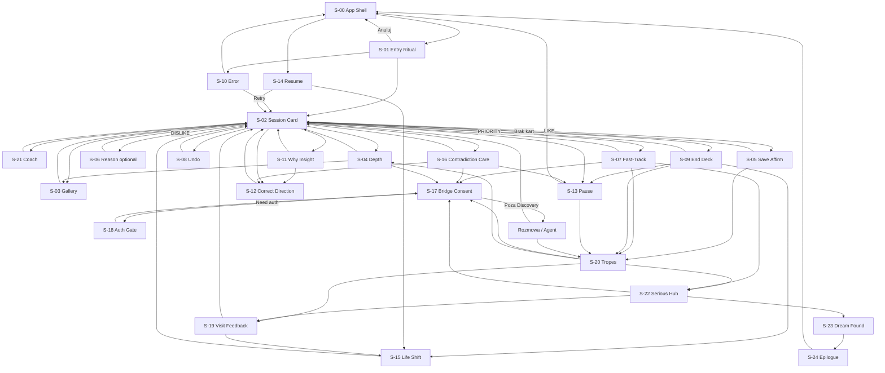

# EstateOS™ Discovery™ — Screen Flow (mapa ekranów i przepływów)

**Status dokumentu:** REVIEW  
**Wersja:** 1.0  
**Ostatnia aktualizacja:** 2026-07-25  
**Właściciel merytoryczny:** UX Designer Apple · Product Owner · Senior Software Architect (powierzchnia logiczna)  
**Zależności:** `03-experience-ux/01-experience-principles.md`, `03-experience-ux/02-user-journey.md`, `01-vision/*`  
**Klasyfikacja:** mapa ekranów logicznych · screen flow · **bez wyglądu** · bez makiet wizualnych · bez kodu  
**Zakaz w tym dokumencie:** kolory, layout, komponenty UI, API kontrakty implementacyjne, schemat DB

---

## 0. Cel dokumentu

Dokument definiuje **kompletny zestaw ekranów logicznych** Discovery™ oraz warunki przepływu między nimi.  
„Ekran” = namacalny stan doświadczenia, który użytkownik rozpoznaje jako osobny moment (pełny ekran, nakładka modalna, lub warstwa pełnoekranowa).

To **nie** jest projekt wyglądu. To mapa nawigacji i danych na granicach przejść.

---

## 1. Konwencje

| Symbol | Znaczenie |
|--------|-----------|
| `S-xx` | Identyfikator ekranu |
| Wejścia | Skąd można tu trafić |
| Wyjścia | Dokąd można stąd wyjść |
| Warunki przejścia | Co musi być prawdą, by przejście zaszło |
| Dane wejściowe | Co ekran „dostaje” logicznie na starcie |
| Dane wyjściowe | Co ekran „oddaje” dalej (zdarzenia, intencje, stan) |

**Aktorzy stanu:** Gość / Zalogowany · Cold start / Z profilem · Sesja aktywna / Pauza · Trop zapisany / brak.

---

## 2. Katalog ekranów

---

### S-00 — App Shell (poza Discovery, kontekst wejścia)

**Cel:** Dać użytkownikowi punkt startu w EstateOS, z którego może wejść w Discovery.  
**Wejścia:** Uruchomienie aplikacji · deep link ogólny · powrót z tła.  
**Wyjścia:** `S-01` Entry Discovery · inne obszary EstateOS (poza zakresem szczegółowym).  
**Możliwe akcje:** Nawigacja tabów · long-press plusa / kanoniczne entry Discovery · logowanie.  
**Warunki przejścia do Discovery:** Użytkownik wybiera entry Discovery; brak obowiązkowej ankiety.  
**Dane wejściowe:** Stan auth · activeVertical (Home/Car — Discovery Home-first wg wizji) · locale.  
**Dane wyjściowe:** Intencja `open_discovery` · timestamp.

---

### S-01 — Discovery Entry / Ritual Gate

**Cel:** Świadome wejście w rytuał Discovery; sygnał „tu wolno nie wiedzieć”; odróżnienie od Radar/filtrów.  
**Wejścia:** `S-00` · deep link `discovery` · powrót z `S-21` po „zacznij od nowa” (opcjonalnie).  
**Wyjścia:** `S-02` (start sesji) · `S-00` (anuluj) · `S-18` (wymagane auth — tylko jeśli polityka produktu kiedyś wymaga; domyślnie NIE blokuje).  
**Możliwe akcje:** Kontynuuj · Anuluj · Krótka informacja „czym jest Discovery”.  
**Warunki przejścia:** `Kontynuuj` → `S-02`. `Anuluj` → `S-00`.  
**Dane wejściowe:** Auth · flaga first_time_discovery · skrót obietnicy.  
**Dane wyjściowe:** `session_start_intent` · `first_time=true/false`.

---

### S-02 — Discovery Session Home (talia / karta wiodąca)

**Cel:** Główne doświadczenie decyzji wobec miejsca (jednostka Discovery).  
**Wejścia:** `S-01` · `S-03`/`S-04` powrót · `S-08` po undo · `S-09` po empty recovery · `S-12` po korekcie · `S-14` resume · `S-15` po zmianie kierunku · `S-16` po kryzysie · `S-19` po feedbacku wizyty.  
**Wyjścia:** `S-03` galeria · `S-04` detal · `S-05` po LIKE · `S-06` po DISLIKE · `S-07` po PRIORITY · `S-08` undo overlay · `S-09` empty · `S-10` offline/error · `S-11` insight · `S-13` pause · `S-00` hard exit · `S-17` bridge.  
**Możliwe akcje:** Gest/akcja LIKE · DISLIKE · PRIORITY/fast-track · OPEN_GALLERY · OPEN_DETAIL · PAUSE/EXIT · UNDO (jeśli dostępne) · WHY (insight) · CORRECT_DIRECTION.  
**Warunki przejścia:**  
- LIKE z progiem intencji → emisja zdarzenia + następna karta lub `S-05` jeśli potrzebny feedback zapisu.  
- DISLIKE → następna karta lub `S-06` jeśli włączony powód.  
- PRIORITY → `S-07`.  
- Brak kart → `S-09`.  
- Błąd feedu → `S-10`.  
**Dane wejściowe:** `card` (oferta zredukowana do decyzji) · `match_hint?` · `session_state` · `profile_soft`.  
**Dane wyjściowe:** `decision_event` · `next_card_request` · `session_metrics_tick`.

---

### S-03 — Smart Gallery (warstwa zdjęć)

**Cel:** Pogłębić odczucie miejsca przez kadry — bez kradzieży decyzji.  
**Wejścia:** `S-02` · `S-04`.  
**Wyjścia:** `S-02` · `S-04` · decyzje LIKE/DISLIKE/PRIORITY mogą być dostępne lub wracać do `S-02` (jedna kanoniczna polityka: decyzja finalna wraca do sesji).  
**Możliwe akcje:** Następne/poprzednie zdjęcie · zamknij galerię · (opcjonalnie) decyzja.  
**Warunki przejścia:** Zamknięcie → `S-02` z `photo_index`. Decyzja → jak w `S-02` + zachowany index.  
**Dane wejściowe:** `images[]` · `photo_index` · `card_id`.  
**Dane wyjściowe:** `photo_index` · `gallery_dwell_ms` · opcjonalnie `decision_event`.

---

### S-04 — Place Depth (głębia miejsca)

**Cel:** Świadome ujawnienie większej ilości faktów o miejscu po decyzji o pogłębieniu.  
**Wejścia:** `S-02` · `S-03` · `S-05`/`S-07` „zobacz więcej”.  
**Wyjścia:** `S-02` · `S-03` · `S-17` bridge · `S-05` zapis.  
**Możliwe akcje:** Powrót · galeria · zapisz · priorytet · przejdź do rozmowy · decyzja tak/nie.  
**Warunki przejścia:** Powrót → `S-02`. Bridge → `S-17` jeśli intencja rozmowy.  
**Dane wejściowe:** `card_full_summary` (logiczny, nie layout) · `profile_soft`.  
**Dane wyjściowe:** `depth_view_event` · opcjonalnie `decision_event` / `save_intent`.

---

### S-05 — Soft Affirmation / Save Prompt (po LIKE lub z detalu)

**Cel:** Potwierdzić „tak” i ewentualnie zaproponować zapis tropu bez presji.  
**Wejścia:** `S-02` LIKE · `S-04` zapis.  
**Wyjścia:** `S-02` (następna karta) · `S-20` lista tropów · `S-02` z zapisem.  
**Możliwe akcje:** Zapisz trop · Tylko kontynuuj · Cofnij decyzję.  
**Warunki przejścia:** Zapisz → `saved_trope` + `S-02`. Kontynuuj → `S-02`. Cofnij → undo + `S-02`.  
**Dane wejściowe:** `card_id` · `decision=LIKE`.  
**Dane wyjściowe:** `save_event?` · `decision_event` · `undo?`.

*Uwaga produktowa:* ten ekran może być lekką nakładką; nie wolno mu stać się formularzem.

---

### S-06 — Dislike Reason (opcjonalny, rzadki)

**Cel:** Opcjonalnie zebrać powód „nie” bez przesłuchania.  
**Wejścia:** `S-02` DISLIKE gdy polityka `ask_reason=true` (rzadko, nie zawsze).  
**Wyjścia:** `S-02` zawsze (z powodem lub pominięciem).  
**Możliwe akcje:** Wybór krótkiego powodu · Pomiń · Zamknij.  
**Warunki przejścia:** Dowolna akcja kończy → `S-02` + następna karta.  
**Dane wejściowe:** `card_id` · lista kanonicznych powodów (cena/lokalizacja/układ/standard/inne).  
**Dane wyjściowe:** `dislike_reason?` · `skipped_reason`.

---

### S-07 — Priority / Fast-Track Confirm

**Cel:** Świadomie potwierdzić intencję „pilniej / z człowiekiem” — chronić przed przypadkiem.  
**Wejścia:** `S-02` PRIORITY · `S-04` priorytet.  
**Wyjścia:** `S-17` (jeśli użytkownik chce most) · `S-02` · `S-20`.  
**Możliwe akcje:** Potwierdź priorytet · Przejdź do rozmowy · Anuluj · Zapisz i kontynuuj.  
**Warunki przejścia:** Potwierdź → `priority_event` + `S-02` lub `S-17`. Anuluj → `S-02` bez priority.  
**Dane wejściowe:** `card_id` · `session_state`.  
**Dane wyjściowe:** `priority_event?` · `bridge_intent?`.

---

### S-08 — Undo Affordance (nakładka / toast sterujący)

**Cel:** Dać godne cofnięcie ostatniej decyzji.  
**Wejścia:** Automatycznie po decyzji z `S-02`/`S-05`/`S-06`/`S-07` w oknie czasu.  
**Wyjścia:** Znika → pozostaje `S-02` · Undo → `S-02` z przywróconą kartą.  
**Możliwe akcje:** Cofnij · Ignoruj (timeout).  
**Warunki przejścia:** Timeout lub kolejna decyzja zamyka undo. Undo w oknie → przywrócenie karty.  
**Dane wejściowe:** `last_decision` · `undo_window_ms`.  
**Dane wyjściowe:** `undo_event?`.

---

### S-09 — End of Deck / Empty Direction

**Cel:** Domknąć kierunek z godnością; nie dokładać szumu.  
**Wejścia:** `S-02` gdy brak kart w kierunku.  
**Wyjścia:** `S-15` zmiana kierunku · `S-14` wróć później · `S-20` tropy · `S-17` · `S-00` · `S-02` jeśli „poszerz eksplorację”.  
**Możliwe akcje:** Poszerz eksplorację · Zmień kierunek · Zobacz zapisane · Pauza · Wyjście.  
**Warunki przejścia:** Wybór akcji → odpowiedni ekran; poszerzenie udane → `S-02`.  
**Dane wejściowe:** `direction_summary` · `saved_count` · `profile_soft`.  
**Dane wyjściowe:** `explore_widen_intent?` · `pause_intent?` · `direction_change_intent?`.

---

### S-10 — Offline / Error Recovery

**Cel:** Jasno powiedzieć, co nie działa; przywrócić sprawczość bez winy.  
**Wejścia:** `S-02`/`S-01`/`S-14` przy błędzie sieci/feed/auth.  
**Wyjścia:** Retry → `S-02` lub `S-01` · `S-00` · tryb ograniczony jeśli dostępna kolejka lokalna.  
**Możliwe akcje:** Spróbuj ponownie · Wyjdź · (opcjonalnie) kontynuuj z kolejką offline decyzji.  
**Warunki przejścia:** Sukces retry → sesja; trwały błąd auth → `S-18`.  
**Dane wejściowe:** `error_kind` · `retryable` · `queued_events_count`.  
**Dane wyjściowe:** `retry` · `abort` · `flush_queue_intent`.

---

### S-11 — Why This / Soft Insight

**Cel:** Skromnie wyjaśnić „dlaczego to” i pozwolić na sprzeciw.  
**Wejścia:** `S-02` akcja WHY · automatycznie rzadko przy wysokiej pewności (polityka oszczędności).  
**Wyjścia:** `S-02` · `S-12` jeśli „to nie ja”.  
**Możliwe akcje:** Zamknij · To nie ja · Zobacz mniej podobnych.  
**Warunki przejścia:** „To nie ja” → `S-12`. Zamknij → `S-02`.  
**Dane wejściowe:** `card_id` · `reason_human` · `confidence_soft`.  
**Dane wyjściowe:** `insight_ack` · `reject_inference_intent?`.

---

### S-12 — Correct Direction („to nie ja” / korekta)

**Cel:** Skorygować wnioski systemu bez ankiety-przesłuchania.  
**Wejścia:** `S-11` · `S-02` · `S-15` · `S-16`.  
**Wyjścia:** `S-02` z nowym `profile_soft` · `S-09` jeśli trzeba przebudować talię.  
**Możliwe akcje:** Odrzuć konkretny wniosek · Poluzuj trop · Ucz się od teraz · Anuluj.  
**Warunki przejścia:** Zastosuj → recompute direction → `S-02`/`S-09`.  
**Dane wejściowe:** `inference_list_soft` · `profile_soft`.  
**Dane wyjściowe:** `correction_events[]` · `relearn_mode`.

---

### S-13 — Pause / Session Closing

**Cel:** Zakończyć sesję z poczuciem postępu, bez kary.  
**Wejścia:** `S-02` EXIT · system idle policy (opcjonalnie).  
**Wyjścia:** `S-00` · `S-20` · `S-14` przy natychmiastowym „nie wychodź — wznów”.  
**Możliwe akcje:** Zakończ · Wznów · Zobacz tropy · (nie: streak/nęcenie).  
**Warunki przejścia:** Zakończ → persist session + `S-00`. Wznów → `S-02`.  
**Dane wejściowe:** `session_summary_soft` · `saved_count`.  
**Dane wyjściowe:** `session_end` · `resume_available=true`.

---

### S-14 — Resume After Return

**Cel:** Przywrócić ciągłość po godzinach/dniach bez re-onboardingu.  
**Wejścia:** `S-01` gdy `resume_available` · `S-00` deep link resume · po `S-10` recovery.  
**Wyjścia:** `S-02` kontynuuj · `S-15` odśwież kierunek · `S-01` start świeży.  
**Możliwe akcje:** Kontynuuj trop · Sprawdź co się przesunęło · Zacznij lekko od nowa.  
**Warunki przejścia:** Wybór → `S-02` lub `S-15`.  
**Dane wejściowe:** `days_since` · `profile_soft` · `last_tropes`.  
**Dane wyjściowe:** `resume_mode` ∈ {continue, refresh, soft_reset}.

---

### S-15 — Life Shift / Direction Change

**Cel:** Obsłużyć zmianę życia/preferencji przez wybór kierunku, nie formularz 20 pól.  
**Wejścia:** `S-09` · `S-14` · `S-12` · `S-02` jawna intencja zmiany.  
**Wyjścia:** `S-02` · `S-12` doprecyzowanie.  
**Możliwe akcje:** Nowy kierunek przez krótkie intencje-hipotezy (opcjonalne, nie brama) LUB „ucz się od moich kolejnych wyborów” · Częściowy reset · Anuluj.  
**Warunki przejścia:** Potwierdź → nowa talia → `S-02`.  
**Dane wejściowe:** `profile_soft` · `shift_hints?`.  
**Dane wyjściowe:** `shift_event` · `retention_policy` (co zachowano).

*Zasada:* jeśli pojawiają się „hipotezy”, są opcjonalne i pomijalne — inaczej łamią non-goals.

---

### S-16 — Contradiction Care (kryzys sprzeczności)

**Cel:** Nazwać napięcie wartości; spowolnić; nie zawstydzać.  
**Wejścia:** `S-02` gdy system wykryje silną sprzeczność (polityka ostrożna) · ręczne „nie wiem”.  
**Wyjścia:** `S-02` wolniejszy rytm · `S-12` · `S-17` · `S-13`.  
**Możliwe akcje:** Kontynuuj wolniej · Skoryguj wnioski · Porozmawiaj z człowiekiem · Pauza.  
**Warunki przejścia:** Wybór ścieżki opieki.  
**Dane wejściowe:** `tension_hypothesis` (np. spokój vs centrum).  
**Dane wyjściowe:** `care_choice` · `tempo_mode=slow`.

---

### S-17 — Human Bridge Consent

**Cel:** Świadoma zgoda na przekazanie kontekstu gustu człowiekowi/agentowi.  
**Wejścia:** `S-07` · `S-04` · `S-16` · `S-20` · `S-22`.  
**Wyjścia:** Zewnętrzny flow rozmowy EstateOS (poza Discovery) · powrót `S-02`/`S-20` · `S-18` jeśli brak auth.  
**Możliwe akcje:** Wybór zakresu udostępnienia · Potwierdź · Anuluj · Podgląd.  
**Warunki przejścia:** Zgoda + auth → wyjście do czatu/agenta z `bridge_payload`. Anuluj → poprzedni.  
**Dane wejściowe:** `card_id?` · `profile_digest_preview` · `scope_options`.  
**Dane wyjściowe:** `bridge_payload` · `consent_record`.

---

### S-18 — Auth Gate (tylko gdy wymagane)

**Cel:** Zalogować / zarejestrować bez niszczenia dorobku Discovery.  
**Wejścia:** `S-17` bez auth · zapis tropów wymagający konta (jeśli polityka) · sync między urządzeniami.  
**Wyjścia:** Sukces → ekran sprzed bramy z migracją · Anuluj → powrót.  
**Możliwe akcje:** Login · Register · Passkey · Anuluj · Kontynuuj lokalnie (jeśli wolno).  
**Warunki przejścia:** Auth OK → merge `local_signals` → powrót.  
**Dane wejściowe:** `return_screen` · `local_signals_pending`.  
**Dane wyjściowe:** `auth_session` · `merge_result`.

*Zasada:* nie używać jako ściany przed pierwszym Discovery.

---

### S-19 — Visit Reality Feedback

**Cel:** Przyjąć sygnał z wizyty („na miejscu zagrało / nie”) i zrekalibrować.  
**Wejścia:** `S-20` · deep link po wizycie · `S-04` „byłem na miejscu”.  
**Wyjścia:** `S-02` · `S-12` · `S-15` · `S-22`.  
**Możliwe akcje:** Zagrało · Nie zagrało · Zagrało inaczej (+ krótki opcjonalny tag) · Pomiń.  
**Warunki przejścia:** Zapis feedbacku → recompute → `S-02`/`S-09`.  
**Dane wejściowe:** `card_id` · `visit_context?`.  
**Dane wyjściowe:** `visit_feedback_event` (waga wysoka).

---

### S-20 — Saved Tropes / Priority List

**Cel:** Bezpieczny powrót do zapisanych i priorytetowych tropów.  
**Wejścia:** `S-05`/`S-07`/`S-09`/`S-13`/`S-02`.  
**Wyjścia:** `S-04` · `S-02` (wznów sesję wokół / poza listą) · `S-17` · `S-19` · `S-22`.  
**Możliwe akcje:** Otwórz · Usuń · Nadaj/usuń priorytet · Feedback wizyty · Bridge · Wróć do sesji.  
**Warunki przejścia:** Wybór pozycji → `S-04`; usunięcie aktualizuje listę.  
**Dane wejściowe:** `tropes[]` · statusy.  
**Dane wyjściowe:** `trope_mutations[]` · `open_card_id`.

---

### S-21 — First-Time Microcopy Coach (znikająca warstwa)

**Cel:** Jedna linijka nauki gestu; znika po sukcesie.  
**Wejścia:** Automatycznie na `S-02` gdy `first_time`.  
**Wyjścia:** Zawsze wraca fokus do `S-02` (nie osobny dead-end).  
**Możliwe akcje:** Dismiss · Auto-dismiss po pierwszym geście.  
**Warunki przejścia:** Po dismiss `coach_done=true`.  
**Dane wejściowe:** `first_time`.  
**Dane wyjściowe:** `coach_completed`.

---

### S-22 — Serious Trope / Closing Path Hub

**Cel:** Skupić uwagę na jednym poważnym tropie przed domknięciem życiowym.  
**Wejścia:** `S-20` priorytet długotrwały · `S-07` · decyzja użytkownika „to poważne”.  
**Wyjścia:** `S-17` · `S-19` · `S-04` · `S-23` · `S-02` (równoległe poszukiwanie świadome).  
**Możliwe akcje:** Domknij z człowiekiem · Zaplanuj wizytę (logicznie) · Odrzuć po namyśle · Wróć do odkrywania.  
**Warunki przejścia:** Domknięcie sukcesu → `S-23`. Odrzuć → `S-19`/`S-02`.  
**Dane wejściowe:** `card_id` · `profile_digest` · `history_short`.  
**Dane wyjściowe:** `closing_intent` · `abandon_serious_trope?`.

---

### S-23 — Dream Found / Journey Honor

**Cel:** Uhonorować znalezienie wymarzonej (właściwej) nieruchomości; oddać sprawczość; cisza sukcesu.  
**Wejścia:** `S-22` potwierdzenie użytkownika „to jest to” · po domknięciu transakcyjnym (sygnał spoza Discovery).  
**Wyjścia:** `S-24` epilog · wyjście do domknięcia EstateOS · `S-00`.  
**Możliwe akcje:** Potwierdź domknięcie poszukiwania · Zostaw Discovery aktywne · Przejdź dalej w ekosystemie.  
**Warunki przejścia:** Potwierdź koniec fazy → `S-24`.  
**Dane wejściowe:** `card_id` · `journey_summary_soft`.  
**Dane wyjściowe:** `search_phase=completed` · `chosen_card_id`.

---

### S-24 — Epilogue / Phase End

**Cel:** Zakończyć fazę poszukiwania z prywatnością i bez nęcenia.  
**Wejścia:** `S-23`.  
**Wyjścia:** `S-00` · ustawienia prywatności (poza Discovery) · przyszły `S-15` gdy nowe życie.  
**Możliwe akcje:** Zakończ fazę · Zarządzaj danymi gustu · Wróć do EstateOS.  
**Warunki przejścia:** Koniec → Discovery nie nęci powrotem.  
**Dane wejściowe:** `search_phase=completed`.  
**Dane wyjściowe:** `phase_end_record` · `retention_preferences`.

---

## 3. Ekrany systemowe / równoległe (skrót)

| ID | Nazwa | Cel |
|----|-------|-----|
| S-90 | Permission soft (powiadomienia) | Prośba tylko gdy sens; nigdy brama Discovery |
| S-91 | Privacy glimpse | Krótki wgląd „czego się uczymy” |
| S-92 | Rate-limit / Abuse cool-down | Ochrona przed kompulsją / nadużyciem (rzadko) |
| S-93 | Vertical mismatch notice | Jeśli ktoś wejdzie z Car vertical — jasne, że Discovery Home (wg zakresu wizji) |

---

## 4. Scenariusze kompletne (przepływy)

### 4.1 Happy path — od zera do domu
`S-00 → S-01 → S-02(+S-21) → (S-03/S-04)* → S-05/S-07 → S-20 → S-22 → S-17 → S-19? → S-23 → S-24`

### 4.2 Cold start z błędami sieci
`S-00 → S-01 → S-10 → retry → S-02 → …`

### 4.3 Gość → konto przy moście
`S-02 → S-07 → S-17 → S-18 → merge → (chat) → S-02/S-20`

### 4.4 Powrót po kilku dniach
`S-00 → S-14 → S-02` lub `S-14 → S-15 → S-02`

### 4.5 Zmiana preferencji życiowych
`S-02 → S-15 → S-02` (opcjonalnie `S-12`)

### 4.6 Kryzys sprzeczności
`S-02 → S-16 → S-02|S-12|S-17|S-13`

### 4.7 Odrzucenie z powodem
`S-02 → S-06 → S-02` (+ `S-08` undo)

### 4.8 Koniec talii
`S-02 → S-09 → S-15|S-02(widen)|S-13|S-20`

### 4.9 Korekta „to nie ja”
`S-02 → S-11 → S-12 → S-02`

### 4.10 Wizyta negatywna i recalibracja
`S-20 → S-19 → S-02/S-15`

### 4.11 Wielomiesięczny nawyk
Cykle: `S-14 → S-02 → S-13` powtarzane; rzadko `S-15`/`S-16`; bez `S-90` nęcenia

### 4.12 Anulowanie entry
`S-00 → S-01 → S-00`

### 4.13 Hard exit w trakcie
`S-02 → S-13 → S-00` (stan wznowienia zachowany)

### 4.14 Priorytet bez rozmowy
`S-02 → S-07 → S-20 → S-02`

### 4.15 Dream found bez wizyty w app (potwierdzenie użytkownika)
`S-22 → S-23 → S-24`

---

## 5. Pełny diagram przepływu użytkownika

---

## 6. Matryca danych na granicach (skrót kanoniczny)

| Przepływ danych | Składniki logiczne |
|-----------------|-------------------|
| `card` | id miejsca · media refs · fakty decyzji · soft reason |
| `decision_event` | typ LIKE/DISLIKE/PRIORITY/OPEN/SAVE/UNDO/VISIT · card_id · photo_index? · reason? · at |
| `profile_soft` | skłonności ujawnione · napięcia · pewność niska/średnia |
| `session_state` | index talii · undo window · tempo_mode · resume token |
| `bridge_payload` | digest zgody · card? · zakres |
| `trope` | card_id · saved/priority · timestamps · visit_status? |

---

## 7. Reguły spójności Screen Flow

1. Żaden happy path nie może wymagać `S-06` zawsze.  
2. `S-18` nie blokuje `S-01→S-02`.  
3. `S-09` nie wolno omijać przez dolewanie szumu bez intencji użytkownika.  
4. `S-23/S-24` nie wolno gamifikować.  
5. Każda decyzja z `S-02` powinna mieć szansę na `S-08` w oknie.  
6. Powrót po dniach idzie przez `S-14`, nie przez pełne `S-01` coach.

---

## Rejestr akceptacji

| Pole | Wartość |
|------|---------|
| Dokument | `docs/discovery/03-experience-ux/03-screen-flow.md` |
| Status | `REVIEW` |
| Ekrany główne | S-00 … S-24 (+ S-90–93) |
| Diagram | Mermaid §5 |
| Następny dokument | tylko po Twojej akceptacji |

**STOP.** Nie powstaje kolejny dokument do czasu Twojej decyzji.

**Koniec dokumentu `03-screen-flow.md`.**
