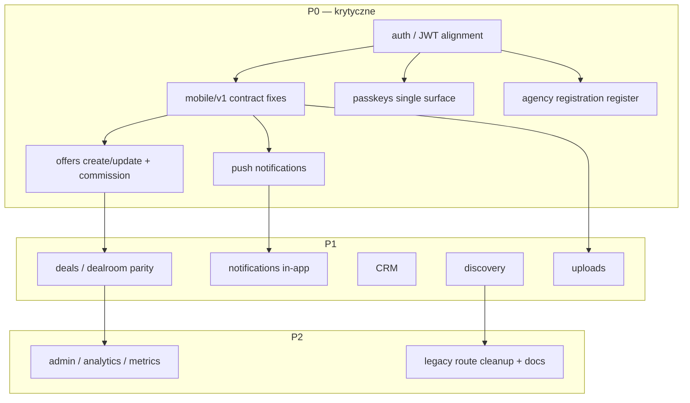
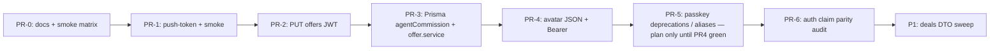

# Master execution plan — reconciliacja Mobile (SoT) ↔ Backend ↔ WWW

**Zasady nadrzędne:** mobile = **canonical** zachowanie i kontrakty API. **Bez** force-merge, hard reset, masowych rewrite’ów, snapshot rollbacków. Każdy etap: **inventory → diff → weryfikacja runtime → fix plan → implementacja → smoke → rollback → deploy verify**. Małe, odwracalne commity. Gałąź referencyjna backendu: `recovery-local-snapshot`.

**Dokumenty pomocnicze:** `mobile-backend-www-master-audit.md` (tabela kontraktów).

---

## 1) Task graph (zależności wysokiego poziomu)

---

## 2) Dependency graph (techniczny — kolejność PR)

*Uwaga:* PR-0 może być sam dokumentacja + smoke; pierwsze zmiany funkcjonalne zaczynają się od **PR-1 (push)**, bo odblokowuje weryfikację prod bez dotykania auth core.

---

## 3) Kolejność PR (numeracja zalecana)

| # | Tytuł | Zakres | Rollback |
|---|--------|--------|----------|
| PR-1 | `feat(mobile): POST /api/mobile/v1/user/push-token` | Nowy route zgodny z appką; rate limit; mapowanie na `Device` | Usunięcie pliku route + revert smoke |
| PR-2 | `fix(mobile): JWT na PUT /api/mobile/v1/offers` | Spójność z POST (Bearer ↔ `userId`) | Revert jednego pliku |
| PR-3 | `feat(prisma): agentCommissionPercent na Offer` + serwis | Migracja DB + walidacja `agentCommission.ts` | Migracja wstecz / drop kolumny |
| PR-4 | `feat(mobile): avatar JSON base64 + Bearer` | Rozszerzenie `user/avatar` o `Content-Type: application/json` | Revert route |
| PR-5 | Passkeys — **plan + ewentualny** thin proxy | Dokumentacja kanonu `/api/passkey/*`; opcjonalnie 301/alias tylko po testach | Wyłączenie aliasu |
| PR-6 | JWT claims / `verifyMobileToken` | Jednolite `id`/`sub`/`userId` w login/passkey finish | Revert lib + login routes |
| P1-… | Deals, notifications, CRM, discovery, uploads | Per domena osobny PR | osobno |

---

## 4) Macierz ryzyka (skrót)

| Obszar | Ryzyko | Mitigacja |
|--------|--------|-----------|
| Push bez Bearer (mobile) | Abuse po email | Rate limit IP + email; walidacja formatu Expo token; logowanie zdarzeń |
| PUT offers + JWT | Regresja klientów wysyłających złe tokeny | 401 z komunikatem; monitor 4xx |
| Migracja Prisma | Lock / downtime | `db push` w oknie lub migracja SQL incremental; backup przed |
| Passkey alias | RP ID / origin break | Tylko proxy bez zmiany krypto; staging E2E |
| Avatar base64 | Payload size / OOM | limit rozmiaru base64 (np. 6MB decode cap) |

---

## 5) Macierz weryfikacji runtime (co uruchomić przed i po każdym PR)

| Check | Przed | Po | Narzędzie |
|-------|-------|-----|-------------|
| `npm run check` | ✓ | ✓ | tsc |
| `npm run build` | ✓ | ✓ | next build |
| `npm run verify:recon` | ✓ | ✓ | Lokalny E2E: build + `next start :3010` + smoke (mobile recon) |
| `POST /api/mobile/v1/user/push-token` (valid body staging) | — | ✓ | curl |
| `PUT /api/mobile/v1/offers` bez Bearer | 200/500 (złe) | **401** | curl |
| Passkey `login/start` | ✓ | ✓ | curl GET/POST wg route |
| Health + DB ping | ✓ | ✓ | `/api/health` |

---

## 6) Szablon checklisty per domena (powiel dla każdego PR)

1. **Inventory:** lista plików mobile + route backend.
2. **Diff analysis:** request/response DTO vs handler.
3. **Runtime verification:** `check` + `build` + smoke + ręczny curl scenariusz kanoniczny.
4. **Fix plan:** 1–2 zdania + pliki dotknięte.
5. **Implementation:** minimalny diff.
6. **Smoke tests:** rozszerzenie `postdeploy-smoke.cjs` lub skrypt domenowy.
7. **Rollback strategy:** `git revert <sha>`; dla DB — migracja down / instrukcja ręczna.
8. **Deploy verification:** PM2 reload, `curl` prod na health + nowy endpoint (read-only GET).

---

## 7) Realizacja — status (aktualizuj przy merge)

| Etap | Status | Commit / notatka |
|------|--------|------------------|
| PR-1 push-token | **implemented** | `src/app/api/mobile/v1/user/push-token/route.ts` + smoke |
| PR-2 PUT offers JWT | **implemented** | `mobile/v1/offers/route.ts` |
| PR-3 agent commission | **implemented (wymaga SQL na DB)** | `prisma/schema.prisma`, `offer.service.ts`, `docs/reconciliation/sql/add_agent_commission_percent.sql` |
| PR-4 avatar JSON | **implemented** | `mobile/v1/user/avatar/route.ts` |
| PR-5 passkeys docs | **implemented** | `docs/reconciliation/PASSKEYS_CANONICAL.md` |
| PR-6 JWT payload parity | **implemented** | `src/lib/jwtMobile.ts` (`sub`, `userId`, `id`) |
| PR-7 mobile admin auth gate | **implemented** | `mobileAdminAuth.ts` + `mobile/v1/admin/*` routes |
| PR-8+ | pending | P1 deals sweep, legacy alias passkeys (staging) |

---

## 8) Smoke / rollback — szybka ściąga

**Rollback jednego PR:** `git revert <sha>` (lub `git revert -m 1 <merge_sha>`), potem `npm run build` + `npm run pm2:reload`.

**DB rollback PR-3:** `ALTER TABLE Offer DROP COLUMN agentCommissionPercent` (tylko po konsultacji z danymi).

**Smoke:** `npm run smoke:postdeploy` (zmienna `SMOKE_BASE_URL` dla zdalnego hosta).

---

## 9) Playbooki domen — P0 (szkielet 8 kroków; uzupełniaj linkami do PR)

### P0-A — Auth (hasło) + mobile login

| Krok | Treść |
|------|--------|
| 1. Inventory | `src/app/api/mobile/v1/auth/login/route.ts`, mobile `useAuthStore` |
| 2. Diff | Body: `email`/`password`; response: `success`, `token`, `user` |
| 3. Runtime | `POST` login staging — 200 + JWT |
| 4. Fix plan | Ujednolicenie komunikatów błędów (opcjonalnie `code`) |
| 5. Implementation | Już zgodne z mobile; rozszerzenia tylko po diff z app |
| 6. Smoke | Brak hasła w repo — manual curl ze staging user |
| 7. Rollback | Revert zmian w login route |
| 8. Deploy verify | 4xx rate limit nie blokuje całej apki |

### P0-B — JWT

| Krok | Treść |
|------|--------|
| 1–2 | `jwtMobile.ts`, wszyscy konsumenci `verifyMobileToken` |
| 3 | Issued token zawiera `id`, `sub`, `userId` |
| 5 | **Zrobione:** `signMobileToken` normalizuje pola |
| 6. Smoke | Dowolny endpoint z Bearer po loginie |

### P0-C — `mobile/v1/*` (ogół)

| Krok | Treść |
|------|--------|
| 1 | Tabela w `mobile-backend-www-master-audit.md` |
| 3 | `npm run check` + `build` + `smoke:postdeploy` |
| 5 | Priorytet: brakujące route → **push-token** ✓; **PUT offers** ✓ |

### P0-D — Passkeys

| Krok | Treść |
|------|--------|
| 1 | Kanon: `PASSKEYS_CANONICAL.md` |
| 5 | Brak masowego redirectu; duplikaty tylko po QA |
| 6. Smoke | `GET /api/passkeys/auth-options` (już w smoke) |

### P0-E — Push

| Krok | Treść |
|------|--------|
| 5 | **POST `/api/mobile/v1/user/push-token`** ✓ |
| 6 | Smoke GET probe ✓ |

### P0-F — Oferty + prowizja

| Krok | Treść |
|------|--------|
| 5 | PUT JWT ✓; Prisma `agentCommissionPercent` + walidacja ✓ |
| 7 | SQL rollback: `docs/reconciliation/sql/add_agent_commission_percent.sql` (inverse) |

### P0-G — Rejestracja agencji

| Krok | Treść |
|------|--------|
| 5 | `companyName` wymagane dla AGENT; response zawiera `companyName` ✓ |

---

## 10) Playbooki — P1 (kolejność po zielonym P0 na prod)

- **Deals:** porównanie payloadów `actions` vs mobile modals; testy na staging dealId.
- **Notifications:** spójność `/api/notifications/*` z mobile (jeśli zacznie wołać).
- **CRM / discovery / uploads:** inventory endpointów używanych w pełnym repo mobile; osobne PR.

---

## 11) Playbooki — P2

- Admin WWW vs mobile admin — rozdzielenie ról i audyt `/api/admin/*`.
- Metryki / analytics — tylko read paths + smoke GET.
- Legacy routes — lista `DUPLICATE` z audytu; deprecate w dokumentacji przed usunięciem.

---

## 12) Macierz weryfikacji — rozszerzenie (postęp)

| Check | Oczekiwany wynik po reconciliacji P0 |
|--------|--------------------------------------|
| `GET /api/mobile/v1/admin/users` bez `Authorization` | **401** |
| `GET /api/mobile/v1/admin/offers` bez Bearer | **401** |
| `GET /api/mobile/v1/admin/radar-analytics` bez Bearer | **401** |

---

*Koniec master planu — aktualizuj §7–§8 przy kolejnych PR.*
